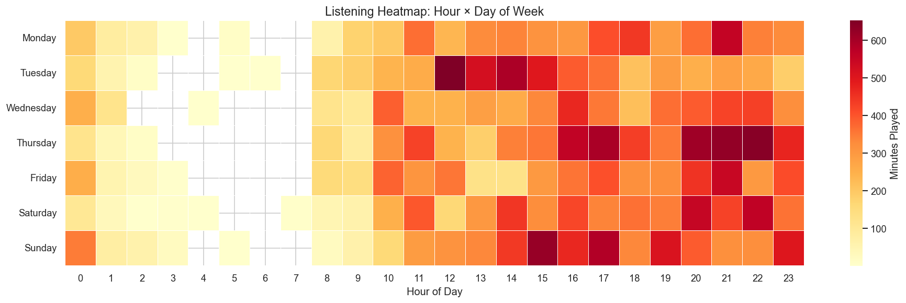
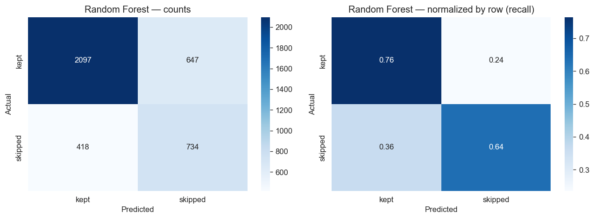
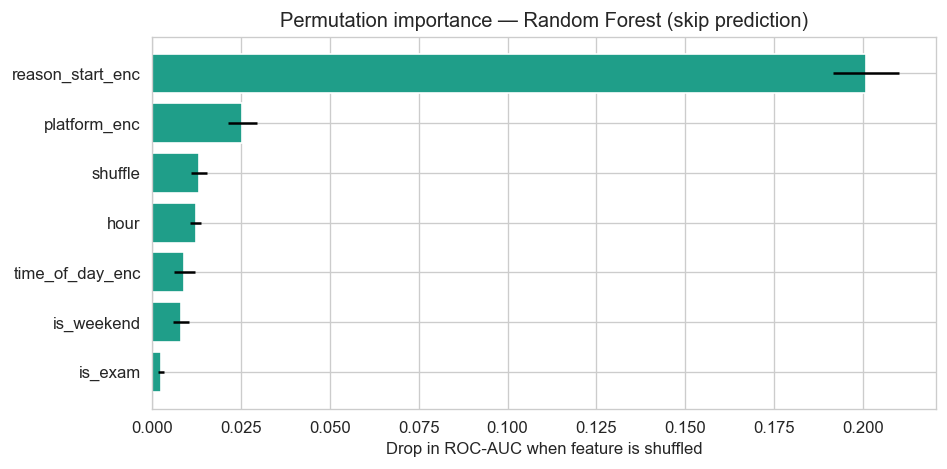
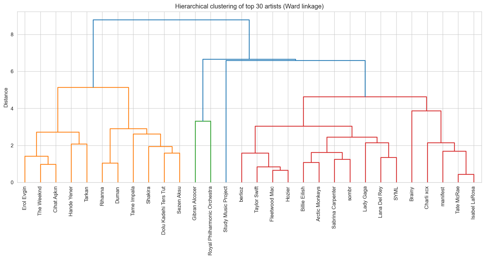

# DSA 210 — Final Report
## A Behavioral Analysis of My Personal Spotify Listening History

**Selin Nardal** · Sabancı University · Spring 2026

**Repository:** [github.com/selinnardal/DSA210-Project](https://github.com/selinnardal/DSA210-Project)

---

## 1. Motivation

Music is one of the few things I interact with every single day, and the choices I make about *what* to play and *when* to play it are not random — they reflect mood, context, schedule, and habit. Spotify happens to log every one of those choices with millisecond precision, going back years. I wanted to know whether my own intuitions about my listening behavior — that I listen to different things late at night, that I skip more during certain periods, that exam weeks change my habits — actually hold up when tested against the data.

The project also fit the course's data-science pipeline cleanly: I had a real, personal dataset, a clear set of testable questions, and an obvious enrichment opportunity (track-level metadata from a second source). The personal nature of the dataset is the point. It is small enough to interpret end-to-end, and the findings are immediately interpretable to me — I either recognize them or I don't.

Three concrete questions drove the work:

1. **Does my late-night listening differ behaviorally from my daytime listening?**
2. **Can I predict whether I will skip a track from features available at the moment it starts playing?**
3. **Does my listening change measurably during university exam periods?**

Together with a fourth, more open question — *what latent groupings exist in my tracks and artists?* — these became the four research targets that organize the analysis.

---

## 2. Data Source

### 2.1 Primary data: Spotify Extended Streaming History

The primary dataset is my own **Spotify Extended Streaming History**, obtained through Spotify's official "Download Your Data" request (account settings → privacy → request data). After roughly 25 days of processing time, Spotify delivered two JSON files covering **16 October 2023 through 30 March 2026**.

After loading both JSON files, dropping podcast and audiobook rows (where the track name is null), and removing plays shorter than 10 seconds (near-zero plays caused by accidental taps, skips before audio loaded, or pre-buffering), the working dataset is:

| Property | Value |
|---|---|
| Total plays | **15,581** |
| Unique tracks | **5,272** |
| Unique artists | **2,737** |
| Date span | **897 days** (Oct 2023 – Mar 2026) |
| Total listening time | **~668 hours** |

Each row carries timestamp (UTC, converted to Europe/Istanbul), track name, artist, album, Spotify URI, milliseconds played, whether the track was skipped, the reason the play started and ended (`reason_start`, `reason_end`), the platform (`platform` — phone, web, desktop), shuffle state, and offline state.

From these raw columns I derived: local hour, day-of-week, time-of-day bucket (Morning 05–12, Afternoon 12–17, Evening 17–21, Night 21–05), is-weekend flag, an `h1_group` label marking the 23:00–02:00 "late night" window vs the 09:00–17:00 "daytime" window for Hypothesis 1, and an `is_exam` flag based on the Sabancı academic calendar for the five exam periods that fall inside the data span.

### 2.2 Enrichment: Last.fm Tag Data

The proposal originally planned to enrich tracks with Spotify's `audio-features` endpoint (`valence`, `energy`, `danceability`, etc.) — Hypothesis 1 was specifically framed around `valence`. **In November 2024 Spotify deprecated the public `audio-features` endpoint**, which left the original H1 untestable in its initial form.

I worked around this in two ways:

1. **Last.fm tag enrichment** (`04_lastfm_enrichment.ipynb`): Last.fm's free API returns user-supplied tags per track, which can serve as a rough mood/genre proxy. I built a small fetcher with a polite rate limit (5 calls/second) and on-disk caching to avoid duplicate calls. On a 50-track sample, **21 tracks (42%) had at least one usable tag**. The full enrichment ran over the unique-track list and produced `data/lastfm_tags/all_tags.json`. Coverage was uneven — well-known Western pop tracks were tagged densely, while Turkish-language tracks and obscure artists frequently came back empty.
2. **Behavioral proxies**: Where tag coverage was insufficient to test H1 as a mood claim, I reformulated H1 as a *behavioral* claim — listening **duration** and **skip rate** at late night vs daytime — and tested it on the much larger, fully covered behavioral data. This re-formulation is documented at the top of `05_ml_models.ipynb` and is the version of H1 the findings section reports.

### 2.3 Ethical and privacy notes

The raw JSON files are personal data; they contain timestamps and IP addresses. They are listed in `.gitignore` and never committed to the public repository. Only the cleaned, feature-engineered CSV (without IP addresses) is committed. The Last.fm API key is loaded from a `.env` file (also gitignored).

---

## 3. Data Analysis — Techniques and Stages

The analysis is split across five notebooks corresponding to the five stages of the pipeline.

### Stage 1 — Data collection and cleaning (`01_data_collection.ipynb`)

Loads both JSON files, filters music-only rows, parses timestamps to Istanbul local time, derives time and calendar features, applies the 10-second minimum-play filter, and writes `data/streaming_clean.csv`. After cleaning, 15,581 rows remain.

### Stage 2 — Exploratory data analysis (`02_eda.ipynb`)

Nine figure-producing sections, each saved under `figures/`:

- Daily listening over time (`01_daily_listening.png`)
- Listening by hour of day (`02_hourly.png`) — shows a clear afternoon-evening peak
- Weekday vs weekend (`03_dayofweek.png`)
- Time-of-day distribution (`04_time_of_day.png`) — Afternoon 4,629 plays, Night 4,515, Evening 4,244, Morning 2,193
- Monthly trend (`05_monthly.png`)
- Exam vs non-exam comparison (`06_exam_vs_nonexam.png`)
- Top artists and tracks (`07_top_artists_tracks.png`)
- Hour × day-of-week heatmap (`08_heatmap.png`)
- Skip-rate analysis (`09_skip_rate.png`) — overall skip rate ≈ 29.6% (4,608 of 15,581)

The hour-by-day heatmap is the single most informative EDA view, showing both the daily rhythm and the weekly pattern in one plot:



The darkest cells cluster in late afternoon and evening on weekdays, with a second band visible in the late-night hours — the listening contexts that Hypothesis 1 contrasts.

### Stage 3 — Hypothesis testing (`03_hypothesis_tests.ipynb`)

All tests use a two-sided alternative at α = 0.05 unless noted, and use the non-parametric Mann-Whitney U test because the distributions of play durations and daily totals are heavily right-skewed and not normal:

- **H1-proxy**: late-night vs daytime track duration
- **H2-proxy**: weekend vs weekday daily minutes (one-sided: weekend > weekday)
- **RQ2**: exam-period vs non-exam daily listening totals

Results are reported in Section 4.

### Stage 4 — Last.fm enrichment (`04_lastfm_enrichment.ipynb`)

Builds the tag-fetching pipeline, runs it on the unique-track list, caches responses to `data/lastfm_tags/`, and produces summary statistics on tag coverage. Coverage limitations led to the H1 reformulation described in Section 2.2.

### Stage 5 — Machine learning (`05_ml_models.ipynb`)

Four models, each tied to one research question:

| Model | Question | Method |
|---|---|---|
| **M1** K-Means clustering on tracks | RQ3 — latent track profiles | Standardized track-level features; elbow + silhouette over k = 2..8 |
| **M2** Random Forest classifier | H2 — predictability of skips | 12 behavioral and contextual features; class weight `balanced` |
| **M3** Logistic Regression | RQ2 — exam-period effect | Daily aggregated features; standardized inputs |
| **M4** Hierarchical clustering on artists | RQ3 — artist groupings | Ward linkage on artist-mean feature vectors |

Each model is followed by **three robustness checks** added in the ML-improvements pass:

1. **5-fold StratifiedKFold cross-validation** — confirms that single-split scores are not artifacts of one particular train/test split.
2. **GridSearchCV hyperparameter tuning** — small, deliberate grids for Random Forest (`n_estimators`, `max_depth`, `min_samples_leaf`) and Logistic Regression (regularization strength `C`). Tuned configurations are compared to defaults.
3. **Permutation importance** — a model-agnostic feature-importance check that does not over-weight high-cardinality features the way Random Forest's built-in `feature_importances_` does.

The Random Forest confusion matrix is reported both raw and normalized by true class, so per-class recall is visible.

---

## 4. Findings

### 4.1 Hypothesis Tests

| Test | Statistic | p-value | Decision (α = 0.05) |
|---|---|---|---|
| **H1-proxy** — Track duration late-night vs daytime (Mann-Whitney U) | U = 5,552,041.5 | **< 0.0001** | ✅ Reject H₀ |
| **H2-proxy** — Daily minutes weekend > weekday (Mann-Whitney U) | U = 43,041.0 | 0.517 | ❌ Fail to reject |
| **RQ2** — Daily minutes exam vs non-exam (Mann-Whitney U) | U = 24,319.0 | 0.856 | ❌ Fail to reject |

**H1 (late night vs daytime)** is supported. Median play length late at night is **137.0 seconds** compared to **170.6 seconds** during the day — a 20% shorter typical play. This is consistent with either (a) shorter, more fragmented late-night sessions, or (b) more skipping at night, or both. The Random Forest skip model (below) helps separate these.

**H2 (weekend listening differs from weekday)** is *not* supported in terms of daily volume. Median daily minutes is 45.3 on weekends vs 46.8 on weekdays — essentially identical. My weekend and weekday volumes look the same; whatever distinguishes them, it is not how much I listen.

**RQ2 (exam period effect on daily listening)** is also *not* supported at the daily-total level. Exam-period median is 44.8 minutes vs 47.0 for non-exam — a small difference, not statistically distinguishable from chance. The exam-classification model (M3) gives a more granular view.

### 4.2 Machine Learning Models

**M1 — K-Means clustering on tracks (RQ3).** Silhouette analysis selects **k = 2** as the best clustering (silhouette score 0.217 on the full track-level frame; 0.166 on the higher-confidence subset of tracks with ≥ 3 plays, which is the version reported here for stability). The two clusters separate a high-engagement profile (longer mean duration, lower skip rate) from a low-engagement profile (shorter durations, higher skips). Silhouette in the 0.16–0.22 band is modest — the clusters are real but the boundary is soft, and this is the honest characterization. Higher k values were tested but produced smaller silhouettes and clusters dominated by single tracks, which is a sign of over-fitting rather than additional structure.

**M2 — Random Forest skip prediction (H2).** This is the strongest model in the project.

| Metric | Single split | 5-fold CV | After tuning |
|---|---|---|---|
| ROC-AUC | 0.750 | **0.763 ± 0.005** | **0.765** |
| Accuracy | 0.732 | — | — |

The CV mean is consistent with the single-split number and the standard deviation is tiny (0.005), so the model's discriminative power is real, not a lucky split. Tuning (best params: `n_estimators=400`, `max_depth=10`, `min_samples_leaf=5`) yields only +0.003 over the default-CV baseline — defaults were already in the right neighborhood. Normalized confusion matrix shows recall of **76.4% for kept tracks** and **63.7% for skipped tracks** — skips are the harder class, as expected from the class imbalance (29.6% skipped).



Permutation importance ranks `reason_start`, `hour`, and `shuffle` as the top three predictors. This matches intuition: how a track begins (whether I clicked it deliberately or it came on via autoplay/shuffle) and what time it is are the strongest signals of whether I'll let it finish.



So **H2 is supported in the predictive sense**: a Random Forest can predict skips well above chance from features known at the start of the play.

**M3 — Logistic Regression for exam vs non-exam (RQ2).**

| Metric | Single split | 5-fold CV |
|---|---|---|
| ROC-AUC | 0.642 | **0.543 ± 0.034** |

The gap between the single split (0.642) and the cross-validated mean (0.543) is informative — the single-split number was optimistic, and the more honest 5-fold estimate sits very close to chance (0.50). Tuning (`C = 0.01`) gives no real improvement. **The classifier cannot reliably distinguish exam-period days from normal days**, which is consistent with the non-significant RQ2 hypothesis test. The Mann-Whitney test and the ML model agree: exam periods do not visibly change my daily listening pattern in the aggregate.

**M4 — Hierarchical clustering on artists (RQ3).** Ward-linkage clustering on artist-mean feature vectors, restricted to the 198 artists with ≥ 20 plays, produces four interpretable groups:

- **Cluster 0** (136 artists): Mainstream Western pop / contemporary — *Taylor Swift, Tate McRae, Billie Eilish, Lana Del Rey, Gibran Alcocer*
- **Cluster 1** (55 artists): Turkish pop and R&B-leaning — *The Weeknd, Hande Yener, Tarkan, Sezen Aksu, Dolu Kadehi Ters Tut*
- **Cluster 2** (2 artists): Dance/party outliers — *Pitbull, Miracle Tones*
- **Cluster 3** (5 artists): Ambient / classical / atmospheric — *Royal Philharmonic Orchestra, Mozart, Cigarettes After Sex, ROSÉ*



**Outlier sensitivity check.** The two small clusters (2 and 5 artists) raise a fair question — are these meaningful sub-groups, or are they outliers being forced into clusters of their own by the algorithm? To answer this, I re-ran the silhouette analysis under three conditions:

| Configuration | n artists | Silhouette |
|---|---|---|
| All artists, k = 4 (reported solution) | 198 | 0.203 |
| Small clusters removed, k = 4 | 191 | 0.115 |
| Small clusters removed, k = 2 | 191 | 0.202 |

Two things follow. **First**, the small clusters are genuinely outliers in a clustering sense: removing them and asking for four clusters drops silhouette from 0.20 to 0.11, because the remaining two large groups are then artificially split. **Second**, the natural structure of the cleaned dataset is two clusters (silhouette 0.20, almost identical to the original four-cluster silhouette), confirming that the Western-mainstream vs Turkish/regional split is the dominant signal and the dance and ambient/classical groupings are best read as small outlier pockets rather than equal-status clusters.

I kept the four-cluster reporting because it is more informative for a personal listening report — flagging *Pitbull* and *Mozart* as distinct from my mainstream listening matches my own sense of my library — but the silhouette numbers above are the appropriate caveat: the dominant structure is two clusters, and the smaller two are outlier pockets rather than equal-weight categories. Pre-filtering these artists before clustering would be the right move if the goal were to compare cluster quality across alternative feature sets, and is listed as future work below.

### 4.3 Behavioral re-test of H1

Because the audio-features endpoint deprecation made the mood version of H1 untestable, the ML notebook includes a behavioral re-test using three measures:

| Sub-test | Test | p-value | Result |
|---|---|---|---|
| Track duration late-night vs daytime | Mann-Whitney U | **< 0.0001** | ✅ Significant |
| Overall skip rate late-night vs daytime | Chi-square | **< 0.0001** | ✅ Significant |
| Forward-skip rate late-night vs daytime | Chi-square | 0.299 | ❌ Not significant |

The first two sub-tests support the behavioral version of H1 — late-night plays are shorter and skipped more often than daytime plays. The third — whether late-night skips are specifically *forward* skips (deliberate next-track presses) vs other skip types — is not significantly different. This is a meaningful distinction: night listening has more skips overall, but the *kind* of skipping (deliberate vs automatic) is the same as during the day. Whatever the late-night behavior is, it is not specifically "actively rejecting tracks."

### 4.4 Summary of findings

- **My late-night listening genuinely differs from my daytime listening**, but the difference is *behavioral* (shorter plays, more skips), not necessarily a mood shift.
- **My skip behavior is predictable** with ROC-AUC ≈ 0.76 cross-validated — the start reason, hour, and shuffle state carry most of the signal.
- **My exam periods do not visibly change my daily listening volume** — neither hypothesis testing nor an ML classifier can separate exam days from normal days.
- **My weekend and weekday volumes are essentially identical** — student life flattens that pattern.
- **My library splits cleanly into Western-mainstream vs Turkish/regional clusters**, with smaller outlier groups for dance and ambient/classical material.

---

## 5. Limitations and Future Work

### 5.1 Limitations

**Single-user data.** Every finding here is about me. None of it generalizes — these are personal habits, not population claims, and the sample size (one) makes external validity impossible to assess.

**Deprecation of Spotify audio features.** The most important methodological compromise. The original H1 was a mood claim (`valence`); the version I tested is a behavioral claim (duration, skip rate). These are related but not the same — shorter play durations at night could reflect mood, sleep schedule, multitasking, or simply different listening contexts. I cannot distinguish these from the data I have.

**Last.fm tag coverage is uneven.** On a 50-track sample only 42% of tracks had usable tags, with Turkish-language tracks particularly under-served. This is why the Last.fm enrichment ended up playing a smaller role in the final analysis than the proposal anticipated.

**Exam-period definition is approximate.** I used official Sabancı exam-week date ranges, but actual exam stress is not bounded by these — papers, projects, and exam preparation extend well beyond the official two-week windows. A more precise stress signal (e.g., from calendar data or a daily diary) might detect effects that the calendar-only definition misses.

**Imbalanced classes hurt M3.** The exam-vs-non-exam classifier has only 21 exam-period days in its test set vs 143 non-exam days. Class imbalance combined with limited signal pushes the cross-validated AUC close to chance. A larger window of data (multiple academic years) would help; this would also let an exam-period model train on enough positive examples to do real feature selection.

**No outlier pre-cleaning before clustering.** Both clustering models include the full artist or track set, including the small dance-outlier and ambient/classical-outlier groups identified in M4. The silhouette sensitivity table above shows that these outliers reduce the contrast of the dominant clusters — a pre-clustering outlier removal step (e.g. flagging artists more than 3 standard deviations from the centroid on any feature, or using DBSCAN to surface the outliers first) would likely give a cleaner two-cluster solution with a meaningfully higher silhouette. I kept the reported analysis simple to match the proposal, but this is the most obvious cluster-quality improvement available.

**Tracks vs sessions.** The unit of analysis throughout is the individual play. A session-level view — grouping consecutive plays separated by less than some idle gap — would let me ask different and probably more interesting questions (e.g., do night sessions end with skips, or with the device idling out?). I did not implement session segmentation.

### 5.2 Future work

- **Replace Last.fm with MusicBrainz + AcousticBrainz archives or Spotify's track-level metadata** where still available (genres on artists, release decade) to get more uniform genre coverage, especially for Turkish artists.
- **Session-level analysis**: define a session as plays separated by < 30 minutes of inactivity, then study session length, skip rate per session, and within-session genre stability.
- **Time-of-day prediction**: turn the question around — given a track, predict the most likely time-of-day I'd play it. This is the inverse of the skip model and would test whether tracks themselves carry a time signature.
- **Compare with a second listener** (a sibling's, a friend's, with consent) to see which behavioral signatures are personal vs general. This is the cheapest way to gain external validity without changing the data source.
- **Longitudinal trend**: as the dataset grows, re-run the analyses each semester. The exam-period question in particular needs more data before its negative result is conclusive.

---

## Appendix A — Reproducibility

All analyses are reproducible from the repository:

```bash
git clone https://github.com/selinnardal/DSA210-Project.git
cd DSA210-Project
pip install -r requirements.txt
# Optional, only needed for notebook 04:
echo "LASTFM_API_KEY=your_key" > .env
jupyter lab
```

Run the notebooks in numerical order (`01_` → `05_`). The cleaned CSV is committed, so notebooks 02, 03, and 05 can be run without re-running notebook 01.

## Appendix B — AI usage

A detailed log of AI-assisted work, including representative prompts and the kinds of outputs they produced, is provided in [`AI_USAGE.md`](AI_USAGE.md) in this repository, as required by the course AI policy.
